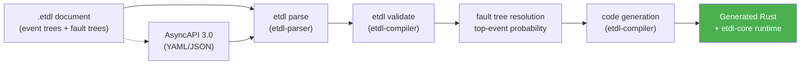

# ETDL — Event Tree Definition Language Compiler

[](https://crates.io/crates/etdl-cli)
[](https://docs.rs/etdl-compiler)
[](LICENSE)
[](https://crates.io/crates/etdl-cli)

**Compile reliability models into code.** ETDL (Event Tree Definition Language) is a declarative, design-time domain-specific language (DSL) that turns event tree analysis (IEC 62502) and fault tree analysis (IEC 61025) into a single `.etdl` document — and compiles that document into production-ready Rust, fully generated, with probability-driven SLAs, retry policies, and chaos injection built in. The same validated model can also generate a thin Java, Python, Go, or C# developer API — all backed by that one Rust implementation, never a per-language reimplementation.

No central workflow engine. No orchestration servers. No runtime interpreters. **Your event tree becomes your code.**

---

## Why ETDL?

Most event-driven systems describe *what* should happen (topics, channels, message schemas) but never *why*, *when*, and *with what reliability* the system must respond. Failures are discovered in production, under load, by pager alerts.

ETDL moves reliability engineering **to design time**:

| Concern | Typical approach | ETDL |
|---|---|---|
| Failure sequences | Implicit in code, scattered across services | **Explicit event trees** (IEC 62502) |
| Failure probability | Guessed, or measured after incidents | **Exact fault trees** (IEC 61025), resolved at compile time |
| SLA behavior | Hand-rolled retry/timeout/backoff in every service | **Generated** `RetryPolicy` + SLA tracker |
| Failure injection | Custom scripts, feature flags, breakage in prod | **Declared** chaos probability, scoped per event tree |
| Contract drift | AsyncAPI docs rot, code diverges | **AsyncAPI 3.0 references resolved at compile time** |
| Process flow | BPMN diagrams no one reads | **Causal event trees that are the code** |

### ETDL vs. alternatives

| | ETDL | Temporal / Cadence | Camunda / BPMN | AWS Step Functions | Hand-rolled sagas |
|---|---|---|---|---|---|
| Central runtime engine | **None** — compiles to code | Yes (workers + server) | Yes (engine) | Yes (AWS-managed) | N/A |
| Reliability modeling | **First-class** (fault trees) | Manual | Manual | Manual | Manual |
| IEC standards | **61025 + 62502** | No | No | No | No |
| Probability-driven SLAs | **Compile-time constant** | No | No | No | No |
| Deployable | Anywhere (library code) | Temporal cluster | Camunda cluster | AWS | — |
| Type-checked contracts | **AsyncAPI + ECEL at build** | Runtime | Runtime | Runtime | No |

ETDL follows the **Smart Endpoints, Dumb Pipes** philosophy: the intelligence lives in your services (as generated, testable Rust functions), not in a centralized brain that becomes a single point of failure.

---

## How it works

An `.etdl` document declares **event trees** (causal sequences of barriers, operations, and consequences) and **fault trees** (how basic events combine into a top-level failure). The compiler validates everything — including probabilistic math, ECEL conditions, and AsyncAPI references — and emits a single Rust function per initiating event.



### What a fault tree becomes at build time

In `order-fulfillment.etdl`, the top event `PaymentGatewayFailure` is an OR of two basic events. The compiler computes the exact probability:

```rust
// Computed from faultTrees.PaymentGatewayFailure.topEvent at build time (Section 5.16)
const PROCESS_PAYMENT_OPERATION_FAILURE_PROBABILITY: f64 = 0.012987;
```

### What an event tree becomes at run time

```rust
pub async fn handle_order_placed_trigger(message: OrderPlaced) -> Result<(), WorkflowError> {
    let mut inventory_check_barrier = BranchMonitor::new("InventoryCheckBarrier");

    if message.payload.items.iter().all(|item| item.qty > 0) {
        inventory_check_barrier.record_branch("InventoryCheckBarrier", "SUCCESS", 0.950000);
        let retry = RetryPolicy {
            max_attempts: 3,
            backoff_ms: 250,
            strategy: BackoffStrategy::Exponential,
        };
        match retry.execute(|| stripe_charge_handler(&message), Duration::from_millis(5000)).await {
            Ok(_result) => {
                publish_to_channel("FulfillmentChannel", _result).await?;
            }
            Err(err) => {
                inventory_check_barrier.record_failure("ProcessPaymentOperation", &err, Some(PROCESS_PAYMENT_OPERATION_FAILURE_PROBABILITY));
                publish_to_channel("DeadLetterChannel", message).await?;
            }
        }
    } else {
        inventory_check_barrier.record_branch("InventoryCheckBarrier", "FAILURE", 0.050000);
        publish_to_channel("DeadLetterChannel", message).await?;
    }
    Ok(())
}
```

---

## Quick Start

```bash
# 1. Install the CLI
cargo install etdl-cli

# 2. Write an .etdl document (or clone the example below)
# 3. Compile it to Rust (the default target — no --target needed)
etdl compile order-fulfillment.etdl --out-dir ./generated

# ...or generate a thin binding in another language — all backed by the
# same authoritative Rust runtime (etdl-runtime-ffi), never a per-language
# reimplementation of ETDL semantics:
etdl compile order-fulfillment.etdl --target java --out-dir ./generated
etdl compile order-fulfillment.etdl --target rust,java,python,go,dotnet --out-dir ./generated

# 4. Validate without generating code
etdl validate order-fulfillment.etdl
```

### Install from source

Prefer this over `cargo install` if you're building against an unreleased
change:

```bash
git clone https://github.com/ETDL-lang/etdl.git
cd etdl
cargo build --release -p etdl-cli   # default features: reliability, discovery, all four language targets
```

The binary lands at `target/release/etdl`; put it on your `PATH` or invoke
it directly. `cargo test --workspace` runs the full test suite. See
[CONTRIBUTING](CONTRIBUTING.md) for the workspace layout, feature flags, and
how to run the conformance suite.

See [Target Architecture](docs/architecture/targets.md) for how `--target`
works, which targets are actually implemented today (`rust`, `java`,
`python`, `go`, `dotnet`), how they all bind to the one Rust runtime
instead of reimplementing it, and which are designed for but not yet built
(JavaScript, TypeScript).

### A complete example

```yaml
etdl: "1.0.0"
info:
  title: "Order Fulfillment Event Tree"
  version: "2.0.0"
  domain: "FulfillmentContext"

asyncapi_imports:
  orders_api: "./asyncapi/orders.yaml"
  payment_api: "./asyncapi/payments.yaml"

eventTrees:
  OrderFulfillment:
    initiatingEvent:
      id: OrderPlacedTrigger
      message: "orders_api#/components/messages/OrderPlaced"
      next: InventoryCheckBarrier

    nodes:
      InventoryCheckBarrier:
        type: barrier
        branches:
          - outcome: SUCCESS
            condition: "message.payload.items[*].qty > 0"
            probability: 0.95
            next: ProcessPaymentOperation
          - outcome: FAILURE
            condition: "default"
            probability: 0.05
            next: OutOfStockConsequence

      ProcessPaymentOperation:
        type: operation
        action: execute
        handler: "stripe_charge_handler"
        emits: "payment_api#/components/messages/PaymentProcessed"
        next: FulfillmentConsequence
        onFailure: PaymentFailedConsequence
        onFailureProbabilitySource: "#/faultTrees/PaymentGatewayFailure/topEvent"
        retryPolicy:
          maxAttempts: 3
          backoffMs: 250
          backoffStrategy: exponential
        timeoutMs: 5000

      FulfillmentConsequence:
        type: consequence
        operation: send
        channel: "orders_api#/channels/FulfillmentChannel"
        message: "payment_api#/components/messages/PaymentProcessed"

faultTrees:
  PaymentGatewayFailure:
    topEvent:
      id: PaymentCaptureFailed
      description: "A charge attempt against the payment gateway does not succeed."
      rootCause: GatewayUnavailableOrRejected
    gates:
      GatewayUnavailableOrRejected:
        type: OR
        inputs:
          - GatewayUnreachable
          - ChargeRejected
    basicEvents:
      GatewayUnreachable:
        description: "Stripe API did not respond within the configured timeout."
        probability: 0.008
      ChargeRejected:
        description: "Stripe API responded with a hard decline."
        failureRate: 0.00021
        missionTime: 24
```

Run:

```bash
etdl compile order-fulfillment.etdl --target rust --out-dir ./generated
```

This validates the document, resolves `PaymentGatewayFailure` to `0.012987`, and emits a `handle_order_placed_trigger` async function that retries with exponential backoff, tracks branch probabilities in a `BranchMonitor`, and routes failures to a dead-letter channel.

---

## Concepts

### Event Trees (IEC 62502)

A tree of **barriers** (decision gates), **operations** (side-effecting actions with retry/backoff/timeout), and **consequences** (outcomes). Every barrier branch carries a probability, and every operation can reference a fault tree for its failure probability. ETDL event trees mirror the *event tree analysis* method used in nuclear safety, aerospace, and process industry risk assessment — applied to event-driven software.

### Fault Trees (IEC 61025)

A Boolean model of how **basic events** combine through **gates** (AND, OR, NOT, XOR, VOTING) into a **top event**. Basic events carry `probability` or `failureRate` + `missionTime` (exponential failure model). The compiler evaluates the tree exactly at build time, so failure probabilities are **constants in your generated code** — no runtime estimation, no surprises.

### ECEL — Event-tree Condition Expression Language

Conditions on barrier branches are written in ECEL, a typed expression language (inspired by CEL) over the AsyncAPI message payload. The compiler type-checks expressions against resolved schemas at build time, catching `qty > "three"` before it ships.

### Probability-linking

`onFailureProbabilitySource: "#/faultTrees/PaymentGatewayFailure/topEvent"` connects an operation's failure to a fault tree. The generated code records the *resolved* probability against the actual failure in the `BranchMonitor`, enabling SLA anomaly detection and chaos injection with declared, deterministic probabilities.

### Runtime (`etdl-core`)

| Component | Purpose |
|---|---|
| `BranchMonitor` | Tracks taken branches, probabilities, and failures per event tree |
| `RetryPolicy` | Async retry with exponential/fixed backoff and max attempts |
| `SlaTracker` | Detects anomaly rates vs. declared probabilities (`ETDL_SLA_WINDOW`, `ETDL_SLA_THRESHOLD`) |
| `ChaosController` | Declared, seeded, scoped failure injection (disabled in production via `ETDL_ENV`) |
| Telemetry | `inject_traceparent` W3C trace context propagation |

---

## Crates

| Crate | crates.io | Description |
|---|---|---|
| `etdl-cli` | [](https://crates.io/crates/etdl-cli) | CLI: compile, validate, analyze, discover, capabilities |
| `etdl-parser` | [](https://crates.io/crates/etdl-parser) | `.etdl` document parser, ECEL parser, AsyncAPI 3.0 resolution with JSON Pointer (RFC 6901) |
| `etdl-compiler` | [](https://crates.io/crates/etdl-compiler) | Semantic validation (E/V/W diagnostics), fault tree evaluation, MOCUS cut sets, target-agnostic `CodeGenerator` trait + the `rust` target, reliability resolution + build manifest |
| `etdl-core` | [](https://crates.io/crates/etdl-core) | Runtime library: BranchMonitor, retry, SLA tracking, chaos injection, telemetry, reliability observations — the authoritative ETDL implementation every non-Rust target binds to |
| `etdl-runtime-ffi` | optional, no toolchain to build | Stable, versioned C ABI over `etdl-core` — what every non-Rust target's generated binding actually calls; build with `cargo build -p etdl-runtime-ffi --release` |
| `etdl-target-java` | optional target | Optional (`--target java`, on by default): Java 21 `java.lang.foreign` binding to `etdl-runtime-ffi` — see [Target Architecture](docs/architecture/targets.md) |
| `etdl-target-python` | optional target | Optional (`--target python`, on by default): stdlib-`ctypes` binding to `etdl-runtime-ffi` |
| `etdl-target-go` | optional target | Optional (`--target go`, on by default): `cgo` binding to `etdl-runtime-ffi` |
| `etdl-target-dotnet` | optional target | Optional (`--target dotnet`, on by default): modern P/Invoke (`LibraryImport`) binding to `etdl-runtime-ffi` |
| `etdl-reliability-core` | built-in reliability | **Built-in** deterministic layer: probability resolution, `.rprob` artifacts, validation — the only reliability dependency of the compiler |
| `etdl-reliability` | [](https://crates.io/crates/etdl-reliability) | Optional richer reliability library: estimates, uncertainty, distributions, evidence, analysis (empirical/Bayesian/sensitivity) |
| `etdl-reliability-ontology` | [](https://crates.io/crates/etdl-reliability-ontology) | Canonical failure taxonomy, ontology versioning, candidate mappings |
| `etdl-failure-discovery` | [](https://crates.io/crates/etdl-failure-discovery) | Source-code failure discovery producing candidate failure modes |
| `etdl-supplement-sdk` | [](https://crates.io/crates/etdl-supplement-sdk) | SDK for writing third-party supplement plugins as sandboxed `.wasm` modules — see [Supplement Plugins](docs/reference/supplement-plugins.md) |

## Reliability layer

ETDL's reliability-engineering layer (the Reliability Supplement, `etdl.reliability`)
adds an opt-in, backward-compatible extension for provenance, uncertainty,
external probability artifacts, failure ontology, discovery, and analysis — without
changing core ETDL semantics or the build-time resolution model. See
[docs/reliability/README.md](docs/reliability/README.md).

The layer is split so that **basic reliability compilation is built-in** (the
compiler depends only on the small `etdl-reliability-core` crate, which is
WASM-compatible), while **advanced reliability engineering is optional**
(`etdl-reliability`, `etdl-reliability-ontology`, `etdl-failure-discovery` are
opt-in dependencies). See
[docs/architecture/features.md](docs/architecture/features.md) and
[docs/architecture/reliability-layers.md](docs/architecture/reliability-layers.md).

**Failure discovery** (`etdl discover`) analyzes Rust source and produces
candidate failure modes with evidence, source locations, and ontology mapping —
deterministically and without inventing probabilities. See
[docs/failure-discovery/README.md](docs/failure-discovery/README.md).

## Supplement plugins

Beyond the two built-in supplements (`reliability`, `discovery`, compiled in
via Cargo feature flags), `etdl-cli` can dynamically load **third-party
supplements as sandboxed `.wasm` modules** — no rebuild of `etdl-cli`
required:

```bash
etdl install <path-or-https-url>   # checks conformance, then installs
etdl supplement list               # built-in extensions + installed plugins
etdl supplement remove <id>
```

Always compiled into `etdl-cli` (not feature-gated). A plugin gets no
filesystem, network, or clock access and runs under a `wasmtime` fuel
budget; malformed or misbehaving plugins become an ordinary diagnostic,
never a host crash. Write one in Rust with
[`etdl-supplement-sdk`](etdl-supplement-sdk), or in any language that
compiles to `wasm32-unknown-unknown` against the documented wire ABI — see
[Supplement Plugins](docs/reference/supplement-plugins.md) for the full
contract.

---

## Documentation

- **[ETDL Specification v1.0.0](https://github.com/ETDL-lang/etdl-specification)** — the formal spec (CC BY 4.0)
- **[Getting Started](docs/getting-started.md)** — install, first document, compile, run
- **[Concepts](docs/concepts/event-trees.md)** — event trees, fault trees, ECEL, probability linking
- **[Architecture](docs/architecture.md)** — compiler pipeline and codegen contract
- **[Target Architecture](docs/architecture/targets.md)** — the `CodeGenerator` trait, the `--target` registry, the `java` target, and the roadmap for Go/.NET/JS/TS/Python
- **[Supplement Plugins](docs/reference/supplement-plugins.md)** — the wire ABI for dynamically loaded, sandboxed `.wasm` supplements
- **[API docs](https://docs.rs/etdl-core)** — `etdl-core`, `etdl-parser`, `etdl-compiler`

## Editor support

- **[VS Code extension](https://github.com/ETDL-lang/etdl-vscode)** (private) — syntax highlighting, live validation (Rust → WASM, no CLI needed), and interactive IEC 62502/61025 event-tree + fault-tree diagrams. `npm run package` builds a `.vsix`.

## Examples

- [Order Fulfillment](etdl-cli/tests/fixtures/order-fulfillment.etdl) — the spec's Section 13 worked example, with AsyncAPI stubs

## Roadmap

- JavaScript/TypeScript targets — WASM for the browser, native Node bindings for Node.js (see [Target Architecture](docs/architecture/targets.md#future-targets-javascripttypescript) for the design)
- A published, versioned distribution of `etdl-runtime-ffi` per platform, so downstream projects don't need to build it from this repository themselves
- Verify `etdl-target-go`'s generated `cgo` code against a real `go build` (implemented but untested — see [Target Architecture](docs/architecture/targets.md#go-etdl-target-go))
- Minimal cut-set reporting CLI (`enumerate_minimal_cut_sets`)
- AsyncAPI 3.0 operation generation (asyncapi-codegen integration)
- Editor language support (syntax highlighting, schema validation)

## Contributing

Contributions are welcome! Open an issue or pull request. See [CONTRIBUTING](CONTRIBUTING.md).

## License

Apache 2.0 — see [LICENSE](LICENSE).
