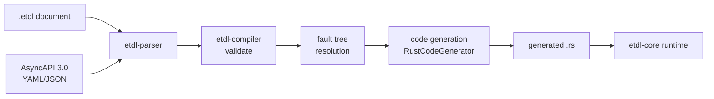

# Architecture

How an `.etdl` document becomes running code.

## Pipeline



### 1. Parse (`etdl-parser`)

- The document AST is deserialized with serde; a manual `Deserialize` implementation normalizes legacy field names (`eventTree` → `eventTrees`) and preserves `x-*` extension fields.
- ECEL conditions are parsed with nom into `Condition::Comparison` / `Condition::Default`.
- `asyncapi_imports` are loaded and registered; message/channel references (`orders_api#/components/messages/OrderPlaced`) are resolved with RFC 6901 JSON Pointer.

### 2. Validate (`etdl-compiler`)

Structural and semantic checks, grouped by diagnostic class:

- **E-1xx** — document structure, version, required fields
- **V-1xx** — info/document integrity
- **V-2xx** — type checking (ECEL against AsyncAPI schemas), probability ranges, barrier branch sums
- **V-3xx** — event tree topology (initiating event reachability, node references)
- **V-4xx** — fault tree correctness (gate arity, cycles, probability computation)
- **V-5xx** — code generation preconditions (handler existence, channel/message existence)
- **W-4xx** — warnings (e.g. unlinked fault trees)

### 3. Resolve fault trees

`resolve_fault_trees` topologically sorts gates, computes each basic event's probability (`probability` or exponential `failureRate`/`missionTime`), evaluates gates, and returns `FaultTreeProbabilities` — a map of tree → top-event probability.

### 4. Generate code

The `CodeGenerator` trait is the extension point for new backends:

```rust
pub trait CodeGenerator {
    fn generate(&self, doc: &EtlDocument, fault_tree_probs: &FaultTreeProbabilities)
        -> Result<GeneratedCode, String>;
}
```

`RustCodeGenerator` emits:

- one `pub async fn handle_<initiating_event>` per event tree,
- a `const` per linked fault-tree top event (the build-time probability),
- `BranchMonitor` instantiation per barrier,
- `RetryPolicy` construction from `retryPolicy`,
- ECEL conditions compiled to wildcard `iter().all(...)` checks,
- channel publishes for consequences,
- failure-path recording with the resolved probability.

### 5. Run (`etdl-core`)

Generated code depends only on `etdl-core` and the message types from your AsyncAPI-generated crates. There is no engine, no server, no interpreter — the tree is the code.

## The codegen contract

Generated functions follow a fixed contract so they compose with any message consumer:

```rust
pub async fn handle_<id>(message: <MessageType>) -> Result<(), WorkflowError>
```

- Return `Ok(())` when all consequences are handled.
- Return `Err` only for non-retryable infrastructure failures in publishing.
- All probabilistic accounting goes through `BranchMonitor`, so SLA and chaos components observe a single source of truth.

## Extension points

| Concern | Extension point |
|---|---|
| New language backends | `codegen::CodeGenerator` trait |
| New gate types | `ast::GateType` + `compute_gate_probability` |
| New condition operators | `ecel::Comparator` + parser + typeck |
| Runtime behavior | `etdl-core` modules (monitor, retry, sla, chaos, telemetry) |
