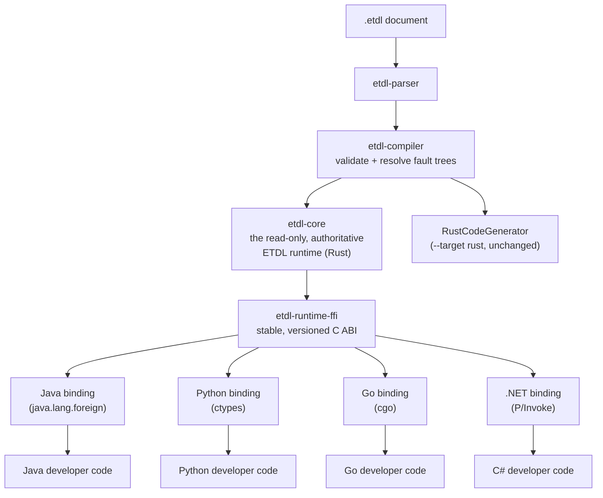

# Target Architecture

How `--target` turns one validated ETDL document into a developer-facing
API in more than one language, all backed by a **single authoritative Rust
implementation** — not a separate reimplementation of ETDL semantics per
language.

## The model



**The Rust runtime is the authoritative, read-only ETDL implementation.**
Branch/SLA accounting (`BranchMonitor`), retry backoff sequencing
(`RetryPolicy`), and ECEL `matches`/`in` evaluation
(`condition::{matches, contains}`) are implemented exactly once, in
`etdl-core`. Every target plugin exposes that same implementation to
developers in their native language — none of them re-implement it.
**Java, Python, Go, and .NET are language-specific developer interfaces
over the one authoritative Rust ETDL implementation, not alternative
implementations of ETDL.**

The `rust` target is the one exception with a different shape, and
deliberately so: Rust generated code links `etdl-core` directly as an
ordinary Rust dependency (no FFI needed — it's already Rust), producing
the `async fn handle_<event>` functions this project has always generated.
Every other target instead generates a thin binding to `etdl-core` running
behind `etdl-runtime-ffi`'s C ABI.

## The Rust runtime boundary (`etdl-runtime-ffi`)

`etdl-runtime-ffi` (new crate) is a stable, versioned, panic-safe
`extern "C"` ABI over `etdl-core` — the *only* new native surface every
non-Rust target binds to. It is not a second runtime: every function is a
thin wrapper directly around the same `etdl_core::BranchMonitor`/
`RetryPolicy`/`condition` module the Rust target's generated code already
used before this change existed.

- **Builds to `cdylib` + `staticlib` + `rlib`** — `libetdl_runtime_ffi.so`/
  `.dylib`/`etdl_runtime_ffi.dll` for dynamic linking (Python's `ctypes`,
  .NET's `LibraryImport`, Go's cgo dynamic mode), the `.a` for Go's
  cgo static-link mode, and an ordinary Rust `rlib` for this repo's own
  tests.
- **Header**: `include/etdl_runtime.h`, regenerated by `cbindgen` on every
  `cargo build -p etdl-runtime-ffi` (via `build.rs`) — it can never drift
  from the actual exported functions. Go's cgo binds against it directly;
  it also serves as the authoritative reference for what the ABI exposes.
- **ABI version**: `etdl_runtime_abi_version()` returns `ETDL_RUNTIME_ABI_VERSION`
  (currently `1`), bumped only on an incompatible signature/semantics
  change to an existing function — a language binding can check it at
  startup and refuse to run (or warn) against a mismatched build.
- **Surface** (the *smallest* set of operations every binding actually
  needs — nothing was added speculatively):
  - `etdl_branch_monitor_{new,free,record_branch,record_success,record_failure}`
  - `etdl_retry_policy_{new,free,delay_ms,execute}`
  - `etdl_condition_{matches,contains}`
  - `etdl_runtime_{version,abi_version}`, `etdl_last_error_message`,
    `etdl_string_free`, `etdl_set_log_callback`
- **Opaque handles, not Rust memory layouts.** `EtdlBranchMonitor`/
  `EtdlRetryPolicy` are boxed Rust values behind raw pointers; no function
  exposes a Rust struct's field layout across the boundary. Every
  cross-boundary value is a primitive, a null-terminated UTF-8 C string,
  or an opaque pointer — the same "narrow ABI, not a leaked implementation"
  approach `etdl-wasm`'s `wasm-bindgen` layer already used.
- **No panic crosses the boundary.** Every exported function runs inside a
  `catch_unwind` guard (`etdl-runtime-ffi/src/lib.rs`'s `guard()`),
  converting a caught panic into a documented sentinel return value plus a
  message retrievable via `etdl_last_error_message()`.
- **Ownership**: every `*_new` returns a handle the caller must release
  with the matching `*_free` exactly once — never twice, never after
  `_free`. Not safe to call concurrently on the *same* handle from
  multiple threads without external synchronization (matching
  `etdl-core`'s own types) — every binding creates one `BranchMonitor` per
  event-tree invocation, exactly like generated Rust code already did,
  which sidesteps this entirely.

### Callbacks: `etdl_retry_policy_execute`

The one place the Rust runtime genuinely needs to call back into
developer-language code is retrying an operation: `etdl_core::RetryPolicy`
already owned the attempt-count/backoff loop for the Rust target, so the
FFI boundary exposes that same loop rather than making every other target
reimplement it:

```c
int32_t etdl_retry_policy_execute(
    const EtdlRetryPolicy *handle,
    int32_t (*callback)(void *user_data, uint32_t attempt),
    void *user_data,
    uint32_t *out_attempts_used
);
```

Rust calls `callback` once per attempt; it must return `0` (success — stop
retrying), positive (retryable failure — sleep the authoritative backoff
delay, try again), or negative (fatal — stop immediately). Every binding's
own language-side exception/error handling converts into this contract
*before* returning across the boundary — a Java `WorkflowError`, a Python
exception, a Go error, a C# exception are all caught in that binding's own
trampoline and turned into `0`/positive/negative, never allowed to
propagate as a genuine unwind/exception into Rust. If a Rust-implemented
callback panics anyway, `etdl_retry_policy_execute` catches it too (via
`extern "C-unwind"` callback types + an inner `catch_unwind`) and treats
it as fatal — see `etdl-runtime-ffi/src/lib.rs`'s
`retry_policy_execute_survives_callback_panic` test.

**No per-attempt timeout is enforced by Rust.** Safely preempting/
cancelling an in-flight call into unknown foreign-language code from
another thread isn't implementable without that language's cooperation, so
`etdl_retry_policy_execute` provides the authoritative attempt-count/
backoff *sequence* only. Every binding applies its own timeout natively
around the callback body instead (Java: a virtual-thread executor +
`Future.get(timeout)`; Python: `ThreadPoolExecutor` + `future.result(timeout=)`;
Go: a goroutine + `time.After`; .NET: `Task.Run` + `Task.Wait(timeout)`) —
the same approach `etdl-target-java` already used for this before
`etdl-runtime-ffi` existed. All four also share the same honest caveat:
none of them can truly kill the timed-out attempt's thread/goroutine/task;
only the *retry loop* moves on.

A second, simpler callback (`etdl_set_log_callback`) demonstrates the same
panic-safe pattern for a one-way (Rust → language) notification, currently
used to surface `etdl_branch_monitor_record_failure` calls to the host
language's own logging.

### Threading, lifetime, and error propagation — summary

| Concern | Design |
|---|---|
| Handle lifetime | Caller-owned; `*_new`/`*_free` pairs, never double-freed, never used after free |
| Cross-thread use | Not supported per-handle without external sync; one handle per invocation avoids it |
| Rust panic → boundary | Always caught (`catch_unwind`), converted to a sentinel + `etdl_last_error_message()` |
| Foreign exception → boundary | Caught in that binding's own trampoline, converted to the documented int contract |
| Native memory | Only opaque handles + owned C strings (freed via `etdl_string_free`) cross the boundary |
| Timeout/cancellation | Not attempted across the boundary; applied natively by each binding around its own callback |
| ABI compatibility | `etdl_runtime_abi_version()`, bumped only on incompatible change |

## The `CodeGenerator` trait and the `etdl-cli` registry

Unchanged from the plain-codegen design: `CodeGenerator::generate_all`
returns `Vec<GeneratedFile>`, one target's output can be one flat file
(Rust) or a whole package/directory tree (Java/Python/Go/.NET); the
registry mapping `--target` names to generators lives in
`etdl-cli/src/targets.rs`, not in `etdl-compiler`, which stays entirely
target-agnostic. Every target listed in `targets::available_targets()` is
gated by its own Cargo feature (`target-java`, `target-python`,
`target-go`, `target-dotnet`; `rust` is unconditional) — an unregistered
name is never advertised, and every registered one produces real, usable
output. `--target rust,java,python,go,dotnet` works in one invocation.

None of `etdl-target-java`/`etdl-target-python`/`etdl-target-go`/
`etdl-target-dotnet` need their language's own toolchain *installed* to
build — each is pure Rust, emitting source text (plus a manifest file:
`.csproj`/`go.mod`) for that language. A JDK/Python/Go toolchain/.NET SDK
is needed only to build or run the *generated* output, and only
`etdl-runtime-ffi`'s compiled library is needed for anything in that
output to actually touch `BranchMonitor`/`RetryPolicy`/`Condition`.

## What each target generates

Every target separates the same two things:

- **Stable/generated/read-only layer**: `etdl-runtime-ffi` (the compiled
  Rust library) + that language's binding to it (`EtdlNative.java`/
  `native.py`/`native.go`/`NativeMethods.cs` and the facade classes wired
  to it) + the generated orchestration class/functions + the generated
  message types + the generated handler interface's *signatures*. All
  regenerated on every `etdl compile`; a developer is never meant to hand-
  edit any of it (every file says so at the top).
- **Developer layer**: a hand-written class/module implementing the
  generated handler interface, and a `Publisher` implementation wiring
  `consequence: send` to a real broker/client. Never regenerated,
  never touched by the generated orchestration except by being called.

### Java (`etdl-target-java`)

Binds via **Java 21's Foreign Function & Memory API**
(`java.lang.foreign` — a preview feature in JDK 21, finalized/flag-free in
JDK 22+; needs `--enable-preview --enable-native-access=ALL-UNNAMED`). No
JNI glue crate, no per-language native C shim — `EtdlNative.java` loads
`libetdl_runtime_ffi` directly and declares `MethodHandle`s for the whole
ABI. `RetryPolicy.execute` binds a per-call trampoline via
`Linker.upcallStub` + `MethodHandles.Lookup.bind`.

- `etdl/runtime/{WorkflowError,Publisher,BackoffStrategy,EtdlNative,BranchMonitor,RetryPolicy,Condition}.java`
- `<package>/<Type>.java` — one `record` per referenced AsyncAPI message
  (both External and Internal References resolve through
  `AsyncApiRegistry::resolve_message`, so — unlike the Rust target — Java
  never assumes a pre-existing `{alias}::messages`-equivalent package
  exists; it generates the record either way)
- `<package>/<Tree>Handlers.java` — one `interface` per event tree
- `<package>/<Stem>Workflow.java` — orchestration + fault-tree constants

Verified end-to-end in this repo's own tests
(`etdl-target-java/tests/java_runtime_integration.rs`): generated Java
calls a hand-authored `Handlers`/`Publisher` implementation, which calls
back through `BranchMonitor`/`RetryPolicy`/`Condition` into the actual
compiled `etdl-runtime-ffi` library — including the retry callback and a
real RE2 regex evaluation through `etdl_core::condition::matches`.

### Python (`etdl-target-python`)

Binds via the **standard library's `ctypes`** — no third-party package,
no compiled Python extension module. `native.py` declares `argtypes`/
`restype` for the whole ABI; `RetryPolicy.execute`'s trampoline is a
`ctypes.CFUNCTYPE` closure (ctypes transparently reacquires the GIL when
Rust calls back into it — the standard, documented ctypes callback
pattern). Message types are `@dataclass`es; handler contracts are `ABC`s.
Condition marshaling uses the stdlib `json` module (no hand-rolled
encoder, unlike Java's — Python has JSON built in).

Verified end-to-end in `etdl-target-python/tests/python_runtime_integration.rs`,
same shape as the Java test.

### Go (`etdl-target-go`)

Binds via **cgo** against `etdl-runtime-ffi`'s cbindgen-generated
`etdl_runtime.h`. `RetryPolicy.Execute`'s trampoline uses
`runtime/cgo.Handle` (the standard mechanism, since Go 1.17, for pinning
Go state and passing an opaque handle through a C callback) plus a small
C shim function per callback site — cgo cannot directly marshal a Go
`//export`ed function into an *anonymous* (non-`typedef`'d) C
function-pointer parameter, so the shim (pure C, calling the real function
with the exported Go trampoline as a named argument) sidesteps that.
Message types are plain `struct`s with `json:"..."` tags (Go field
ordering has no constraint, unlike Python/C#, so schema property order is
preserved); handler contracts are `interface`s. A generated `go.mod`
(`module etdlgenerated`) makes the output buildable standalone.

**Known scope limits, specific to Go:**
- Every generated function returning `error` must return on every code
  path (Go, unlike Java/Python/C#, does not tolerate "falls off the end"
  for a function with a return type) — barrier codegen adds a defensive
  final `else` (returning a `WorkflowError`) when the source document's
  last branch isn't `condition: default`.
- Optional message fields are **not** pointer-wrapped (`*T`) the way the
  Python/C# targets' nullable fields are: ECEL condition codegen generates
  plain field-access/comparison expressions with no schema-type awareness
  of which fields are optional, so a `*T` would require a nil-check/deref
  at every access site codegen doesn't have enough information to safely
  insert. The tradeoff: a Go struct can't distinguish "field absent" from
  "field present with its zero value."
- **Unlike the Java/Python/.NET targets, this target's generated `cgo`
  code has not been verified against a real `go build`** — no Go
  toolchain was available while implementing it. `go_build_*` tests in
  `etdl-target-go/tests/go_generation.rs` exist and will actually verify
  it the moment a `go` toolchain is present (CI or a developer machine);
  today they skip with an explicit message rather than silently passing.
  See that file and `etdl-target-go/src/lib.rs`'s module doc comment for
  the specific idioms used and the one line (`C.bool` vs. the documented
  fallback `C._Bool`) most likely to need a one-word fix.

### .NET (`etdl-target-dotnet`)

Binds via modern, source-generated P/Invoke: `[LibraryImport]` (.NET 7+,
compile-time marshaling, no runtime reflection) for every ABI function,
and `[UnmanagedCallersOnly]` + `GCHandle` for `RetryPolicy.Execute`'s
trampoline (the standard, documented .NET idiom for a static native
callback that needs access to per-call managed state). `.NET's own
default native-library resolver already applies the platform naming
convention to a bare `"etdl_runtime_ffi"` name; `NativeLibrary.SetDllImportResolver`
adds an `ETDL_RUNTIME_LIBRARY` environment-variable override on top.
Message types are `record`s (required constructor parameters before
optional ones, like Python's `@dataclass` — required-before-optional is a
positional-record constructor constraint C# shares with Python but not
Java or Go); handler contracts are `interface`s. `System.Text.Json` (BCL,
no NuGet package) handles condition JSON marshaling. A generated
`<Stem>.csproj` targets `net9.0` specifically — targeting a framework
version other than the installed SDK's own major version makes the SDK
download that version's runtime packs from NuGet on first build, which is
slow and unnecessary; change the one line if your SDK is a different
major version.

Verified end-to-end in `etdl-target-dotnet/tests/dotnet_runtime_integration.rs`.

## Future targets: JavaScript/TypeScript

Not implemented in this change (per explicit scope: "unless it is
straightforward within the existing architecture" — a browser/Node split
is not). The ABI design already accounts for it, though:

- **Browser**: cannot load a native Rust binary at all — the path there is
  compiling `etdl-core` to WebAssembly (reusing `etdl-wasm`'s existing
  `wasm-bindgen` approach, the closest existing analog to
  `etdl-runtime-ffi`'s own JSON/opaque-handle marshaling style) rather
  than binding to `etdl-runtime-ffi`'s native C ABI.
- **Node.js**: can load a native addon — a `napi-rs`-style native binding
  to `etdl-runtime-ffi` (or to `etdl-core` directly) is the natural
  analog of the Python/Go/.NET bindings above.
- **TypeScript**: generates genuine `.ts` types from the same AsyncAPI
  schema resolution every other target's message types already use (real
  types, not renamed JS), sharing whichever of the above two runtime
  strategies the calling context needs.

This is exactly why `etdl-runtime-ffi` exists as a distinct crate/ABI
layer rather than being folded into any one target: **the architecture
does not assume every future target uses the same FFI mechanism** — cgo,
`java.lang.foreign`, `ctypes`, and P/Invoke are four different mechanisms
already; WASM would be a fifth, and it binds to the same underlying
`etdl-core`, not a sixth reimplementation of it.

## Adding a target

1. Create a new crate (`etdl-target-<name>`), depending only on
   `etdl-parser`/`etdl-compiler` (`default-features = false`).
2. Implement `CodeGenerator` for it, reusing `EtlDocument`,
   `AsyncApiRegistry`, and the resolved `fault_tree_probs` map exactly as
   given.
3. For a target needing a native binding: bind to `etdl-runtime-ffi`'s C
   ABI (see `include/etdl_runtime.h`) using whatever mechanism is
   idiomatic for that language — do **not** implement
   `BranchMonitor`/`RetryPolicy`/`Condition` natively in the new language.
4. Add the crate to the workspace `members` list; add it as an optional,
   Cargo-feature-gated dependency of `etdl-cli`
   (`etdl-cli/src/targets.rs` + `Cargo.toml`).
5. None of this touches `etdl-compiler`'s parsing, validation, or
   fault-tree-resolution code, or `etdl-runtime-ffi`'s own ABI (unless the
   new target genuinely needs a new primitive — in which case, add the
   smallest possible addition there, following the "reuse etdl-core,
   don't reimplement it" rule the four existing bindings already follow).

## Building and using each target

```bash
# Build the CLI with every target enabled (the default):
cargo build -p etdl-cli --release

# Rust (default target — no flag needed):
etdl compile order-fulfillment.etdl --out-dir ./generated

# Any other target, alone or combined:
etdl compile order-fulfillment.etdl --target java --out-dir ./generated
etdl compile order-fulfillment.etdl --target rust,java,python,go,dotnet --out-dir ./generated

# Build the native runtime every non-Rust target's generated output needs:
cargo build -p etdl-runtime-ffi --release
# -> target/release/libetdl_runtime_ffi.{so,dylib} / etdl_runtime_ffi.dll
#    target/release/libetdl_runtime_ffi.a (static)
#    etdl-runtime-ffi/include/etdl_runtime.h
```

```bash
# Java (JDK 21+; --enable-preview only needed on JDK 21, not 22+):
javac --release 21 --enable-preview -d out $(find . -name '*.java')
java --enable-preview --enable-native-access=ALL-UNNAMED \
     -Detdl.runtime.library=/path/to/target/release/libetdl_runtime_ffi.so \
     -cp out your.package.Main
```

```bash
# Python (3.9+, stdlib only):
ETDL_RUNTIME_LIBRARY=/path/to/target/release/libetdl_runtime_ffi.so \
  python3 -c "import your_package.main; your_package.main.main()"
```

```bash
# Go (module is self-contained via the generated go.mod):
CGO_CFLAGS="-I/path/to/etdl-runtime-ffi/include" \
CGO_LDFLAGS="-L/path/to/target/release" \
LD_LIBRARY_PATH="/path/to/target/release" \
  go build ./...
```

```bash
# .NET (SDK 8+; generated .csproj targets net9.0 by default):
ETDL_RUNTIME_LIBRARY=/path/to/target/release/libetdl_runtime_ffi.so \
  dotnet run
```

## Running each target crate's own test suite standalone

Each `etdl-target-{java,python,go,dotnet}` crate carries its own copy of
the handful of `.etdl` fixtures its tests need (`tests/fixtures/`,
duplicated from `etdl-cli/tests/fixtures` — deliberately, so these crates
build and test without a `../etdl-cli` relative path, e.g. once split into
their own repos per the multi-repo structure this project is moving
toward). Their runtime-integration tests still need a *built*
`etdl-runtime-ffi` to link/load, which they locate in this order:

1. `ETDL_RUNTIME_FFI_LIB_DIR` (all four) / `ETDL_RUNTIME_FFI_INCLUDE_DIR`
   (Go only, for the cgo header) — explicit env vars, set these in CI or
   whenever `etdl-runtime-ffi` isn't a Cargo workspace sibling.
2. This crate's own workspace `target/{debug,release}` — works today,
   while all of this lives in one `etdl` workspace (building
   `etdl-runtime-ffi` on demand if it isn't already built).
3. `../etdl/target/{debug,release}` (and, for Go,
   `../etdl/etdl-runtime-ffi/include`) — the documented sibling-checkout
   convention: clone `etdl` next to a standalone target-crate repo and its
   build output is found automatically, no env var needed.

Every runtime-integration test skips with a clear message (never a
failure) if none of these produce a usable library — the same pattern
already used for a missing `javac`/`python3`/`go`.

## Platform/toolchain limitations

- **Go**: generated code follows well-documented `cgo` idioms throughout
  but has not been compiled against a real `go` toolchain in this
  project's own development/test environment (see the Go section above).
- **Every non-Rust target** needs a locally built `etdl-runtime-ffi` (this
  repository provides the crate; it is not yet published as a
  binary/package per platform) — there is no `apt install`/`brew install`
  path yet, only `cargo build -p etdl-runtime-ffi --release`.
- **Java** requires `--enable-preview` specifically on JDK 21 (the FFM API
  is finalized and flag-free from JDK 22 onward).
- **.NET**'s generated `.csproj` defaults to `net9.0`; an SDK whose major
  version doesn't match triggers a (correctness-neutral, just slow) NuGet
  download of that other version's runtime packs on first build.
- **No WASM/browser or Node.js target exists yet** — see "Future targets"
  above for the intended shape.
- **No published, versioned distribution of `etdl-runtime-ffi` exists
  yet** for a downstream project to depend on without vendoring/building
  this repository — a natural next step once the ABI has had time to
  stabilize in practice.
