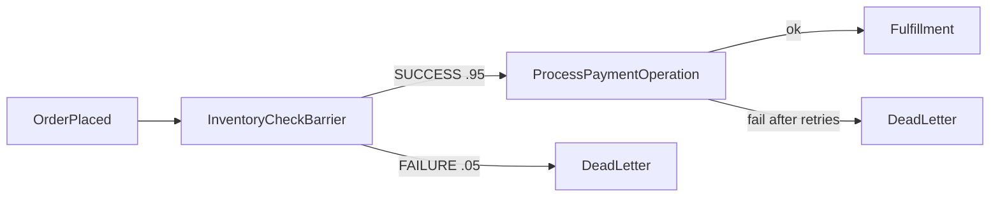

# Event Trees

> Reference: **IEC 62502:2010 — Analysis techniques for dependability: Event tree analysis (ETA)**

An event tree models the causal sequence that follows an **initiating event**: the system passes through a series of **barriers** (which may succeed or fail), executes **operations** (which may succeed or fail), and lands in a **consequence** (an outcome state).

ETDL event trees are a direct software-engineering application of the event tree analysis method used in nuclear safety, aerospace, and the process industry — except the tree **compiles to code** and runs in your service.

## Anatomy of an event tree

```yaml
eventTrees:
  OrderFulfillment:
    initiatingEvent:
      id: OrderPlacedTrigger
      message: "orders_api#/components/messages/OrderPlaced"
      next: InventoryCheckBarrier
    nodes:
      ...
```

| Field | Meaning |
|---|---|
| `initiatingEvent.id` | Identifier; becomes the Rust handler name `handle_<id>` |
| `initiatingEvent.message` | AsyncAPI message reference that starts the tree |
| `initiatingEvent.next` | First node in the sequence |

## Node types

### Barrier

A decision gate with mutually exclusive branches, each carrying an ECEL condition and a probability.

```yaml
InventoryCheckBarrier:
  type: barrier
  branches:
    - outcome: SUCCESS
      condition: "message.payload.items[*].qty > 0"
      probability: 0.95
      next: ProcessPaymentOperation
    - outcome: FAILURE
      condition: "default"
      probability: 0.05
      next: OutOfStockConsequence
```

- Branch probabilities of the same barrier must sum to 1.0 (validated).
- One branch may use the `default` condition as the fallback.
- Generated code records every taken branch in a `BranchMonitor` with its declared probability.

### Operation

A side-effecting action with a retry policy, timeout, failure path, and optional fault-tree-linked failure probability.

```yaml
ProcessPaymentOperation:
  type: operation
  action: execute
  handler: "stripe_charge_handler"
  emits: "payment_api#/components/messages/PaymentProcessed"
  next: FulfillmentConsequence
  onFailure: PaymentFailedConsequence
  onFailureProbabilitySource: "#/faultTrees/PaymentGatewayFailure/topEvent"
  retryPolicy:
    maxAttempts: 3
    backoffMs: 250
    backoffStrategy: exponential
  timeoutMs: 5000
```

| Field | Meaning |
|---|---|
| `handler` | The service function to call (a `fn(&T) -> Result<O, Error>`) |
| `emits` | AsyncAPI message emitted on success |
| `retryPolicy` | `maxAttempts`, `backoffMs`, `backoffStrategy` (`fixed` / `exponential`) |
| `timeoutMs` | Total time budget for the operation |
| `onFailure` | Consequence node for the failure path |
| `onFailureProbabilitySource` | JSON Pointer to a fault tree top event (see [Probability Linking](probability-linking.md)) |

The generated code wraps the handler in `etdl_core::retry::RetryPolicy` and, on exhaustion, records the failure against the resolved fault-tree probability in the `BranchMonitor`.

### Consequence

A terminal outcome. Consequences typically emit a message to an AsyncAPI channel.

```yaml
FulfillmentConsequence:
  type: consequence
  operation: send
  channel: "orders_api#/channels/FulfillmentChannel"
  message: "payment_api#/components/messages/PaymentProcessed"
```

## Full picture



## Generated code contract

Each initiating event produces one async function:

```rust
pub async fn handle_<initiating_event_id>(message: <MessageType>) -> Result<(), WorkflowError>
```

The function:

1. instantiates `BranchMonitor::new("<node_id>")` per barrier,
2. evaluates ECEL conditions with wildcard expansion,
3. executes operations via `RetryPolicy` with timeout,
4. records branch/failure telemetry,
5. publishes consequences to channels,
6. returns `Ok(())` after all consequences are handled.
