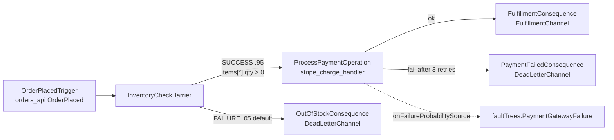

# Example: Order Fulfillment

The canonical ETDL example — the Section 13 worked example of the specification. It models the order-to-fulfillment lifecycle with a payment failure quantified by a fault tree.

## Source files

- [order-fulfillment.etdl](../../etdl-cli/tests/fixtures/order-fulfillment.etdl)
- [asyncapi/orders.yaml](../../etdl-cli/tests/fixtures/asyncapi/orders.yaml)
- [asyncapi/payments.yaml](../../etdl-cli/tests/fixtures/asyncapi/payments.yaml)

## Compile

```bash
etdl compile order-fulfillment.etdl --target rust --out-dir ./generated
```

## The model

### Event tree



### Fault tree

```yaml
faultTrees:
  PaymentGatewayFailure:
    topEvent:
      id: PaymentCaptureFailed
      rootCause: GatewayUnavailableOrRejected
    gates:
      GatewayUnavailableOrRejected:
        type: OR
        inputs: [GatewayUnreachable, ChargeRejected]
    basicEvents:
      GatewayUnreachable: { probability: 0.008 }
      ChargeRejected:     { failureRate: 0.00021, missionTime: 24 }
```

OR-gate probability:

```
P = 1 − (1 − 0.008)(1 − (1 − e^(−0.00021·24)))
  ≈ 1 − 0.992 × 0.994971 ≈ 0.012987
```

## Generated Rust

```rust
// AUTOGENERATED BY ETDL COMPILER v1.0.0 - DO NOT EDIT DIRECTLY

use std::time::Duration;
use etdl_core::telemetry::BranchMonitor;
use etdl_core::retry::{RetryPolicy, BackoffStrategy};
use orders_api::messages::*;
use payment_api::messages::*;

// Computed from faultTrees.PaymentGatewayFailure.topEvent at build time (Section 5.16)
const PROCESS_PAYMENT_OPERATION_FAILURE_PROBABILITY: f64 = 0.012987;

pub async fn handle_order_placed_trigger(message: OrderPlaced) -> Result<(), WorkflowError> {
    let mut inventory_check_barrier = BranchMonitor::new("InventoryCheckBarrier");

    if message.payload.items.iter().all(|item| item.qty > 0) {
        inventory_check_barrier.record_branch("InventoryCheckBarrier", "SUCCESS", 0.950000);
        let retry = RetryPolicy {
            max_attempts: 3,
            backoff_ms: 250,
            strategy: BackoffStrategy::Exponential,
        };
        match retry.execute(|| stripe_charge_handler(&message), Duration::from_millis(5000)).await {
            Ok(_result) => {
                publish_to_channel("FulfillmentChannel", _result).await?;
            }
            Err(err) => {
                inventory_check_barrier.record_failure("ProcessPaymentOperation", &err, Some(PROCESS_PAYMENT_OPERATION_FAILURE_PROBABILITY));
                publish_to_channel("DeadLetterChannel", message).await?;
            }
        }
    } else {
        inventory_check_barrier.record_branch("InventoryCheckBarrier", "FAILURE", 0.050000);
        publish_to_channel("DeadLetterChannel", message).await?;
    }
    Ok(())
}
```

Note the wildcard ECEL condition compiled to `iter().all(|item| item.qty > 0)`.

## What to notice

1. **The probability is a constant** — computed once at build time from the fault tree.
2. **Retry behavior is declared, not coded** — `maxAttempts: 3`, exponential backoff at 250ms, 5s budget.
3. **Failure recording is automatic** — `record_failure` with the resolved probability feeds the SLA tracker and chaos controller.
4. **Dead-letter routing is explicit** — two failure modes, two distinct consequences, both to `DeadLetterChannel` with different message types.
