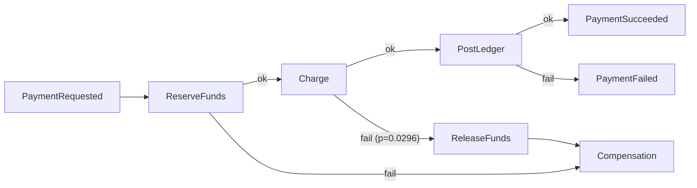

# Example: Payment Saga

A realistic multi-service scenario: a payment that must reserve funds, charge, and reconcile — modeled as an ETDL document. This shows how ETDL expresses the classic saga pattern with quantified reliability.

## The model

```yaml
etdl: "1.0.0"
info:
  title: "Payment Saga"
  version: "1.0.0"
  domain: "PaymentsContext"

asyncapi_imports:
  payment_api: "./asyncapi/payments.yaml"
  ledger_api: "./asyncapi/ledger.yaml"

eventTrees:
  PaymentSaga:
    description: "Reserve funds, capture, then post the ledger entry; failures route to compensation."
    initiatingEvent:
      id: PaymentRequestedTrigger
      message: "payment_api#/components/messages/PaymentRequested"
      next: ReserveFundsOperation

    nodes:
      ReserveFundsOperation:
        type: operation
        description: "Holds the authorization on the customer's payment method."
        action: execute
        handler: "reserve_funds_handler"
        emits: "payment_api#/components/messages/FundsReserved"
        next: ChargeOperation
        onFailure: CompensationConsequence
        retryPolicy:
          maxAttempts: 2
          backoffMs: 100
          backoffStrategy: fixed
        timeoutMs: 2000

      ChargeOperation:
        type: operation
        description: "Captures the authorized amount."
        action: execute
        handler: "capture_charge_handler"
        emits: "payment_api#/components/messages/ChargeCaptured"
        next: PostLedgerOperation
        onFailure: ReleaseFundsOperation
        onFailureProbabilitySource: "#/faultTrees/PaymentCaptureFailure/topEvent"
        retryPolicy:
          maxAttempts: 3
          backoffMs: 250
          backoffStrategy: exponential
        timeoutMs: 5000

      ReleaseFundsOperation:
        type: operation
        description: "Compensating action: releases the held funds."
        action: execute
        handler: "release_funds_handler"
        emits: "payment_api#/components/messages/FundsReleased"
        next: CompensationConsequence
        onFailure: CompensationConsequence

      PostLedgerOperation:
        type: operation
        description: "Writes the final ledger entry."
        action: execute
        handler: "post_ledger_entry_handler"
        emits: "ledger_api#/components/messages/LedgerEntryPosted"
        next: PaymentSuccessConsequence
        onFailure: PaymentFailedConsequence
        retryPolicy:
          maxAttempts: 2
          backoffMs: 200
          backoffStrategy: fixed
        timeoutMs: 1500

      PaymentSuccessConsequence:
        type: consequence
        operation: send
        channel: "payment_api#/channels/PaymentOutcomeChannel"
        message: "payment_api#/components/messages/PaymentSucceeded"

      PaymentFailedConsequence:
        type: consequence
        operation: send
        channel: "payment_api#/channels/PaymentOutcomeChannel"
        message: "payment_api#/components/messages/PaymentFailed"

      CompensationConsequence:
        type: consequence
        operation: send
        channel: "payment_api#/channels/DeadLetterChannel"
        message: "payment_api#/components/messages/CompensationCompleted"

faultTrees:
  PaymentCaptureFailure:
    description: "The capture step cannot be completed."
    topEvent:
      id: CaptureFailed
      rootCause: CaptureGatewayFailure
    gates:
      CaptureGatewayFailure:
        type: OR
        inputs:
          - Timeout
          - HardDecline
          - InsufficientFunds
    basicEvents:
      Timeout:           { probability: 0.005 }
      HardDecline:       { probability: 0.010 }
      InsufficientFunds: { probability: 0.015 }
```

## Compile

```bash
etdl compile payment-saga.etdl --target rust --out-dir ./generated
```

## Flow



## What this shows

1. **Saga = event tree** — the compensation path (`ReleaseFundsOperation`) is just a node, not a special feature.
2. **Compensating action is itself an operation** with its own (lower) retry budget — and its own failure consequence.
3. **The capture failure probability is exact**: `1 − (1−0.005)(1−0.010)(1−0.015) ≈ 0.0296`, embedded in generated code and compared against observed rates by `SlaTracker`.
4. **Different reliability budgets per step** — `ReserveFunds` retries twice with fixed backoff; `Charge` retries three times exponentially. The document is the single source of truth.
